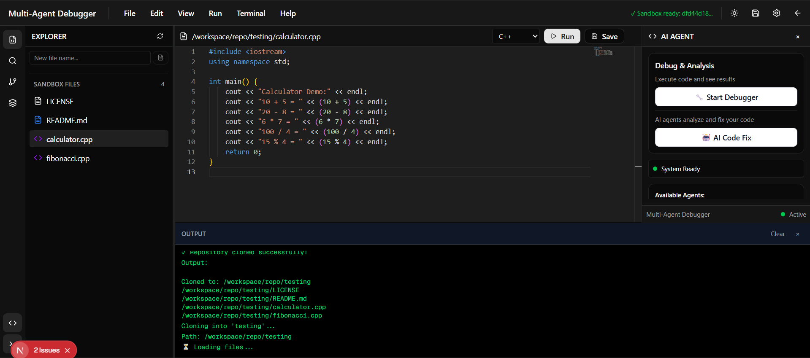
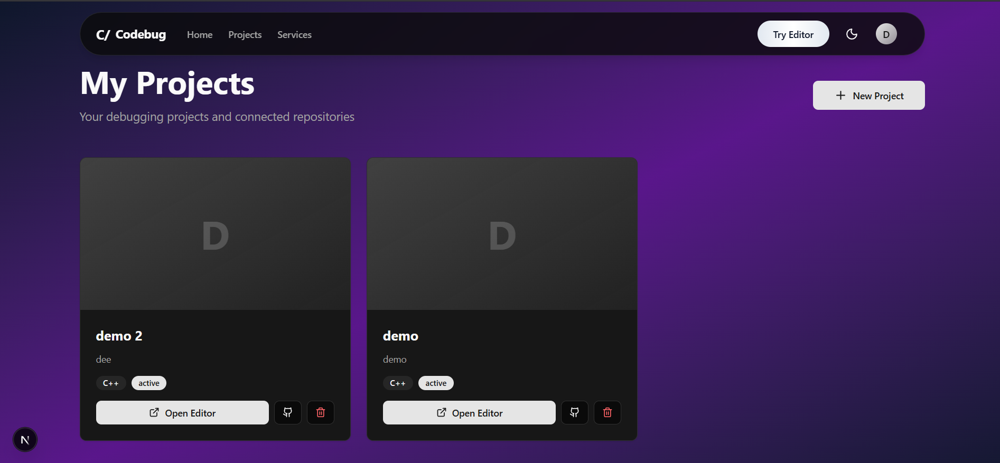
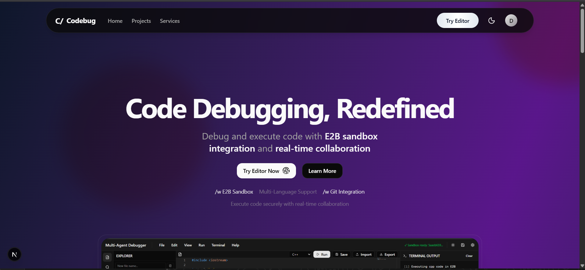
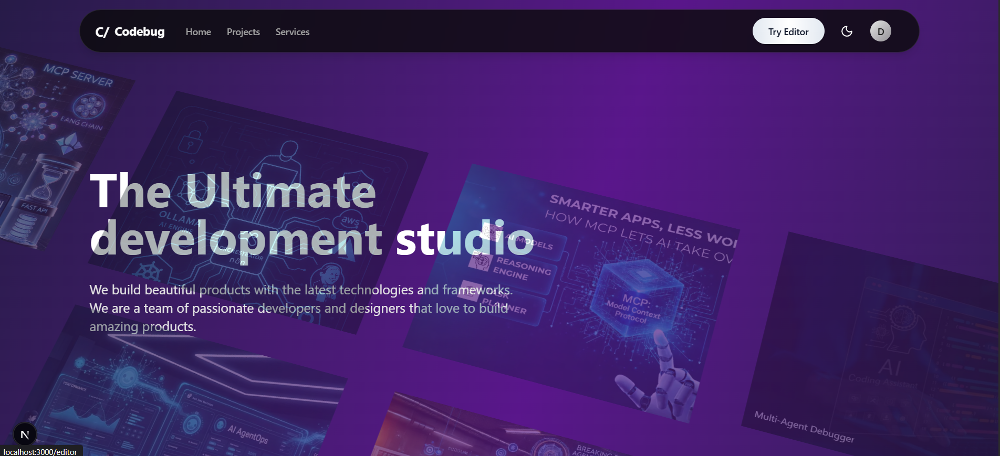
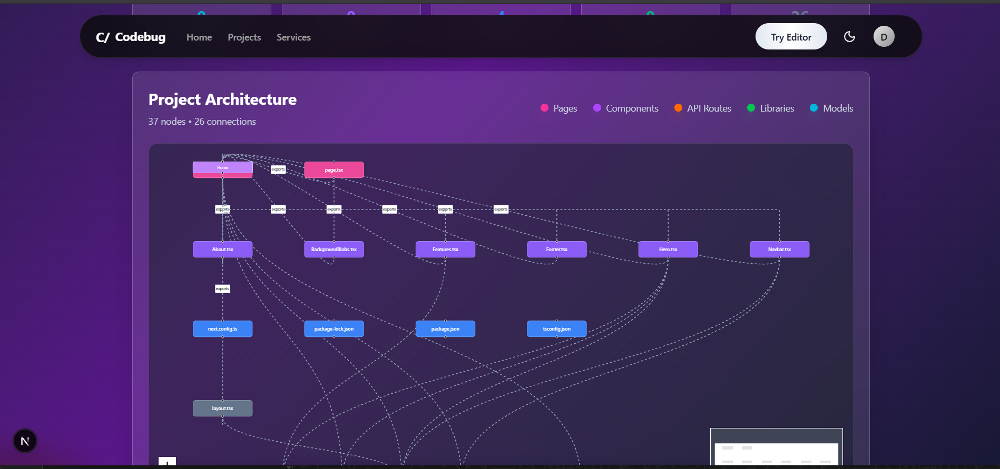

# 🐛 Multi-Agent Code Debugger


An intelligent, AI-powered code debugging platform that combines multi-agent systems with cloud-based code execution. Debug, analyze, and fix code across multiple programming languages with the help of AI agents working collaboratively.

## 📸 Screenshots

<div align="center">

### Landing Page



### Code Editor Interface



### Multi-Agent Debug Workflow



### Project Graph Analyzer



### AI-Powered Code Fixes



</div>

## ✨ Features

### 🤖 Multi-Agent Debugging System

- **Scanner Agent**: Analyzes code for syntax errors, security vulnerabilities, and best practice violations
- **Validator Agent**: Validates code logic, type checking, and runtime errors
- **Fixer Agent**: AI-powered automatic code fix suggestions using Gemini 2.5 Flash
- **Orchestrator Agent**: Coordinates agent workflow using Inngest for reliable execution

### 💻 Code Editor

- **Monaco Editor Integration**: Full-featured code editor with syntax highlighting
- **Multi-Language Support**: JavaScript, Python, Java, C++, and more
- **Real-time Execution**: Run code instantly in isolated E2B sandboxes
- **File Management**: Create, edit, and manage project files
- **Git Integration**: Clone repositories, commit, push, and pull changes

### 🔍 Project Analysis Tools

- **GitHub Repository Analyzer**: Visualize project structure with interactive graphs
- **Dependency Mapping**: Automatic detection of imports and connections
- **Architecture Visualization**: ReactFlow-powered project graph with:
  - Pages, Components, API Routes detection
  - Library and utility file categorization
  - Model and schema file identification
  - Hooks and configuration file mapping
  - Real-time connection visualization

### 🎯 Code Execution Environment

- **Isolated Sandboxes**: E2B-powered cloud sandboxes for secure code execution
- **Multiple Languages**: Support for JavaScript, Python, Java, C++, Rust, Go
- **Real-time Output**: Live stdout/stderr streaming
- **60-second Timeout**: Automatic process termination for long-running code
- **Stdin Support**: Interactive input for programs

### 🔐 Authentication & User Management

- **Supabase Auth**: Secure authentication with email/password
- **User Profiles**: Personal dashboard with project history
- **Session Management**: Persistent login sessions
- **Protected Routes**: Secure API endpoints

### 📊 Debug Sessions

- **Session Tracking**: Monitor all debugging sessions
- **History**: View past analysis results
- **Statistics**: Track debugging metrics
- **Export Results**: Download analysis reports

## 🚀 Getting Started

### Prerequisites

- **Node.js** >= 18.x
- **npm** or **yarn** or **pnpm**
- **Git** for version control
- **E2B API Key** - [Get one here](https://e2b.dev)
- **Gemini API Key** - [Get one here](https://ai.google.dev)
- **Supabase Project** - [Create one here](https://supabase.com)
- **Inngest Account** - [Sign up here](https://www.inngest.com)

### Installation

1. **Clone the repository**

   ```bash
   git clone https://github.com/yourusername/multi-agent-debugger.git
   cd multi-agent-debugger
   ```

2. **Install dependencies**

   ```bash
   npm install
   # or
   yarn install
   # or
   pnpm install
   ```

3. **Set up environment variables**

   Create a `.env.local` file in the root directory:

   ```env
   # E2B Sandbox Configuration
   E2B_API_KEY=your_e2b_api_key_here

   # Gemini AI Configuration
   GEMINI_API_KEY=your_gemini_api_key_here

   # Supabase Configuration
   NEXT_PUBLIC_SUPABASE_URL=your_supabase_project_url
   NEXT_PUBLIC_SUPABASE_ANON_KEY=your_supabase_anon_key
   SUPABASE_SERVICE_ROLE_KEY=your_supabase_service_role_key

   # NextAuth Configuration
   NEXTAUTH_SECRET=your_nextauth_secret_here
   NEXTAUTH_URL=http://localhost:3000

   # Inngest Configuration
   INNGEST_EVENT_KEY=your_inngest_event_key
   INNGEST_SIGNING_KEY=your_inngest_signing_key
   ```

4. **Set up Supabase Database**

   Run the migration script in your Supabase SQL editor:

   ```bash
   # The migration file is located at:
   supabase/migrations/001_initial_schema.sql
   ```

   This creates tables for:

   - Users and profiles
   - Projects
   - Debug sessions
   - Repositories

5. **Set up E2B Sandbox Template**

   Build your custom sandbox template:

   ```bash
   cd sandbox/codedebugger
   npm run build:prod
   ```

   This creates an E2B template with:

   - Node.js runtime
   - Python 3.x
   - Java JDK
   - G++ compiler
   - Git
   - Common development tools

6. **Run the development server**

   ```bash
   npm run dev
   ```

   Open [http://localhost:3000](http://localhost:3000) in your browser.

7. **Start Inngest Dev Server** (in a separate terminal)

   ```bash
   npx inngest-cli dev
   ```

## 📖 Usage Guide

### 1. Code Editor

#### Basic Execution

1. Navigate to `/editor`
2. Write or paste your code in the Monaco editor
3. Select the programming language
4. Click **"Run"** to execute in an isolated sandbox
5. View output in the OUTPUT panel

#### Debug with AI

1. Write your code in the editor
2. Click **"Start Debugger"** for syntax checking without AI
3. Click **"AI Code Fix"** to run the full multi-agent analysis

#### Clone GitHub Repository

1. Click **"File"** → **"Clone Repository"**
2. Enter GitHub repository URL
3. Files will load in the sidebar
4. Browse and edit files directly

#### Git Operations

**Clone Repository**

- Click File → Clone Repository
- Enter: `https://github.com/username/repository`

**Commit Changes**

- Make changes to files
- Click Git → Commit
- Enter commit message

**Push to Remote**

- Click Git → Push
- Requires authentication

**Pull from Remote**

- Click Git → Pull
- Syncs with latest changes

### 2. Project Graph Analyzer

1. Go to `/services`
2. Paste a GitHub repository URL
3. Click **"Analyze Repository"**
4. View interactive project graph
5. Click **"Export"** to download as JSON

### 3. Multi-Agent Workflow

```
User submits code → Orchestrator → Scanner → Validator → Fixer → Results
```

## 🏗️ Architecture & Flow Diagrams

### System Architecture

The Multi-Agent Debugger follows a layered architecture with clear separation of concerns:

```
┌─────────────────────────────────────────────────────────────────────────────┐
│                            CLIENT LAYER (Next.js Frontend)                   │
├─────────────────────────────────────────────────────────────────────────────┤
│                                                                               │
│  ┌──────────────┐  ┌──────────────┐  ┌──────────────┐  ┌──────────────┐   │
│  │   Landing    │  │  Code Editor │  │   Services   │  │  My Projects │   │
│  │     Page     │  │    /editor   │  │   /services  │  │ /my-projects │   │
│  └──────┬───────┘  └──────┬───────┘  └──────┬───────┘  └──────┬───────┘   │
│         └──────────────────┴──────────────────┴──────────────────┘            │
│                                      │                                        │
│                      ┌───────────────┴───────────────┐                       │
│                      │    Shared Components Layer     │                       │
│                      │  - Monaco Editor               │                       │
│                      │  - ReactFlow Graph             │                       │
│                      │  - Auth Components             │                       │
│                      │  - UI Components (shadcn)      │                       │
│                      └───────────────┬───────────────┘                       │
└──────────────────────────────────────┼─────────────────────────────────────┘
                                       │
┌──────────────────────────────────────┼─────────────────────────────────────┐
│                          API LAYER (Next.js App Router)                      │
├─────────────────────────────────────────────────────────────────────────────┤
│  ┌─────────────────┐  ┌─────────────────┐  ┌─────────────────┐             │
│  │ /api/debug/*    │  │ /api/sandbox/*  │  │ /api/analyze-*  │             │
│  │ - analyze       │  │ - execute       │  │ - code          │             │
│  │ - trigger       │  │ - files         │  │ - project       │             │
│  │ - poll          │  │ - git           │  │                 │             │
│  └────────┬────────┘  └────────┬────────┘  └────────┬────────┘             │
└───────────┼─────────────────────┼─────────────────────┼─────────────────────┘
            │                     │                     │
┌───────────┼─────────────────────┼─────────────────────┼─────────────────────┐
│                          SERVICE LAYER (lib/)                                │
├─────────────────────────────────────────────────────────────────────────────┤
│  ┌──────────────────┐  ┌──────────────────┐  ┌──────────────────┐          │
│  │ E2B Sandbox      │  │ Gemini Client    │  │ Git Client       │          │
│  │ - executeCode()  │  │ - AI Analysis    │  │ - Clone/Push/Pull│          │
│  └────────┬─────────┘  └────────┬─────────┘  └────────┬─────────┘          │
│           └──────────────────────┴──────────────────────┘                    │
└──────────────────────────────────┼───────────────────────────────────────────┘
                                   │
┌──────────────────────────────────┼───────────────────────────────────────────┐
│                      AGENT LAYER (Inngest Functions)                         │
├─────────────────────────────────────────────────────────────────────────────┤
│  ┌──────────────┐  ┌──────────────┐  ┌──────────────┐  ┌──────────────┐   │
│  │   Scanner    │  │  Validator   │  │    Fixer     │  │ File Writer  │   │
│  │    Agent     │  │    Agent     │  │    Agent     │  │    Agent     │   │
│  └──────┬───────┘  └──────┬───────┘  └──────┬───────┘  └──────┬───────┘   │
│         └──────────────────┴──────────────────┴──────────────────┘            │
└──────────────────────────────────────────────────────────────────────────────┘
```

### Multi-Agent Debug Workflow

```
USER SUBMITS CODE
      │
      ▼
┌──────────────────────────────────────┐
│  Frontend: Editor Component          │
│  - User clicks "AI Code Fix"         │
│  - Validates code not empty          │
└─────────────────┬────────────────────┘
                  │
                  ▼ POST /api/debug/analyze
┌──────────────────────────────────────┐
│  Inngest: Orchestrator Agent         │
│  - Coordinates agent execution       │
└─────────────────┬────────────────────┘
                  │
    ┌─────────────┼─────────────┐
    │             │             │
    ▼             ▼             ▼
┌────────┐   ┌────────┐   ┌────────┐
│Scanner │→  │Validator→  │ Fixer  │
│Agent   │   │Agent   │   │Agent   │
└────────┘   └────────┘   └────────┘
                  │
                  ▼
          ┌───────────────┐
          │ Results to UI │
          └───────────────┘
```

### Code Execution Flow

```
USER CLICKS "RUN"
      │
      ▼
┌──────────────────────────────────────┐
│  POST /api/sandbox/execute           │
│  - Validate input                     │
└─────────────────┬────────────────────┘
                  │
                  ▼
┌──────────────────────────────────────┐
│  E2B Sandbox Manager                 │
│  - Initialize sandbox                 │
│  - executeCode(language, code)        │
└─────────────────┬────────────────────┘
                  │
                  ▼
┌──────────────────────────────────────┐
│  E2B Container Execution             │
│  - Isolated environment               │
│  - 60 second timeout                  │
│  - Capture stdout/stderr              │
└─────────────────┬────────────────────┘
                  │
                  ▼
          Return Output to UI
```

### Repository Analysis Flow

```
USER ENTERS GITHUB URL
      │
      ▼
┌──────────────────────────────────────┐
│  POST /api/analyze-project           │
└─────────────────┬────────────────────┘
                  │
                  ▼
┌──────────────────────────────────────┐
│  E2B: Clone Repository               │
│  git clone --depth 1 <url>           │
└─────────────────┬────────────────────┘
                  │
                  ▼
┌──────────────────────────────────────┐
│  Categorize Files                    │
│  - Pages, Components, APIs            │
│  - Libraries, Models, Hooks           │
│  - Config, Utils, Other               │
└─────────────────┬────────────────────┘
                  │
                  ▼
┌──────────────────────────────────────┐
│  Parse Imports & Dependencies        │
│  - Detect import statements           │
│  - Match file paths                   │
│  - Build connection graph             │
└─────────────────┬────────────────────┘
                  │
                  ▼
┌──────────────────────────────────────┐
│  ReactFlow Visualization             │
│  - Interactive graph                  │
│  - Category-based colors              │
│  - Export as JSON                     │
└──────────────────────────────────────┘
```

> 📚 **For detailed architecture documentation**, see [ARCHITECTURE.md](ARCHITECTURE.md)  
> 📊 **For complete flow diagrams**, see [FLOW.md](FLOW.md)

## 🏗️ Project Structure

```
multi-agent-debugger/
├── app/
│   ├── api/                      # API Routes
│   ├── editor/                   # Code editor page
│   ├── services/                 # Project analyzer
│   └── components/               # UI components
├── lib/
│   ├── e2b-sandbox.ts           # E2B integration
│   ├── gemini-client.ts         # AI client
│   ├── inngest/agents/          # AI agents
│   └── supabase/                # Database
├── sandbox/codedebugger/        # E2B template
└── components/ui/               # UI components
```

## 🛠️ Tech Stack

- **Next.js 16.1.0** - React framework
- **TypeScript** - Type-safe development
- **E2B** - Cloud code execution
- **Gemini AI** - Code analysis
- **Inngest** - Workflow orchestration
- **Supabase** - Database & Auth
- **Monaco Editor** - Code editor
- **ReactFlow** - Graph visualization

## 🔌 API Reference

**Execute Code**

```typescript
POST /api/debug/analyze
{ "code": "...", "language": "javascript", "sessionId": "..." }
```

**Analyze Project**

```typescript
POST /api/analyze-project
{ "repoUrl": "https://github.com/user/repo" }
```

**Clone Repository**

```typescript
POST /api/sandbox/git
{ "sessionId": "...", "action": "clone", "repoUrl": "..." }
```

## 🚢 Deployment

**Deploy to Vercel**

1. Push to GitHub: `git push origin main`
2. Import to [vercel.com](https://vercel.com)
3. Add environment variables
4. Deploy

**Required Environment Variables:**

- `E2B_API_KEY`
- `GEMINI_API_KEY`
- `NEXT_PUBLIC_SUPABASE_URL`
- `NEXT_PUBLIC_SUPABASE_ANON_KEY`
- `NEXTAUTH_SECRET`
- `INNGEST_EVENT_KEY`
- `INNGEST_SIGNING_KEY`

## 🤝 Contributing

1. Fork the repository
2. Create feature branch: `git checkout -b feature/amazing-feature`
3. Commit changes: `git commit -m 'Add amazing feature'`
4. Push to branch: `git push origin feature/amazing-feature`
5. Open a Pull Request

## 📝 License

MIT License - see [LICENSE](LICENSE) file for details

## 🙏 Acknowledgments

- **E2B** - Cloud sandbox infrastructure
- **Google Gemini** - AI-powered analysis
- **Inngest** - Workflow orchestration
- **Supabase** - Database and authentication
- **Vercel** - Deployment platform

## 🗺️ Roadmap

- [ ] More programming languages (Ruby, PHP, C#)
- [ ] Real-time collaborative editing
- [ ] Custom sandbox templates
- [ ] VSCode extension
- [ ] Team workspaces
- [ ] Advanced git operations (branches, merges)
- [ ] Code review AI agent
- [ ] Docker container support
- [ ] Private repository support

## 📊 Supported Languages

| Language   | Execution | AI Analysis | Syntax Check |
| ---------- | --------- | ----------- | ------------ |
| JavaScript | ✅        | ✅          | ✅           |
| TypeScript | ✅        | ✅          | ✅           |
| Python     | ✅        | ✅          | ✅           |
| Java       | ✅        | ✅          | ✅           |
| C++        | ✅        | ✅          | ✅           |

**Built with ❤️ for developers**

⭐ Star this repo if you find it useful!
