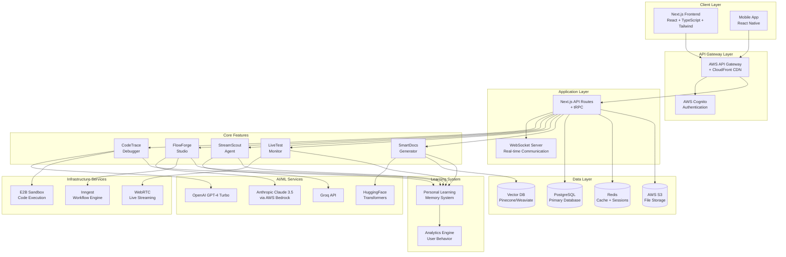
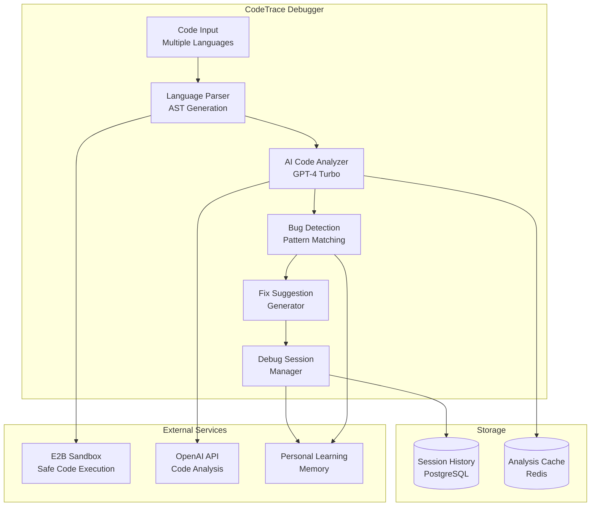
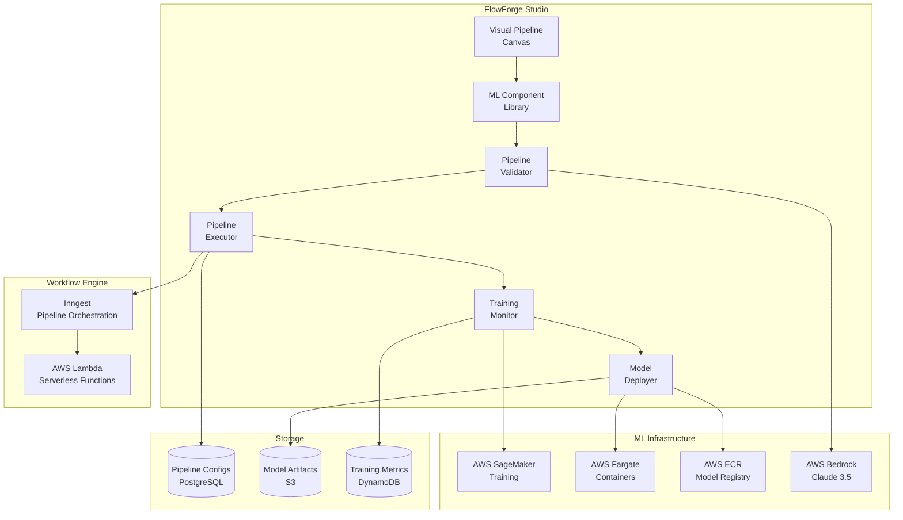
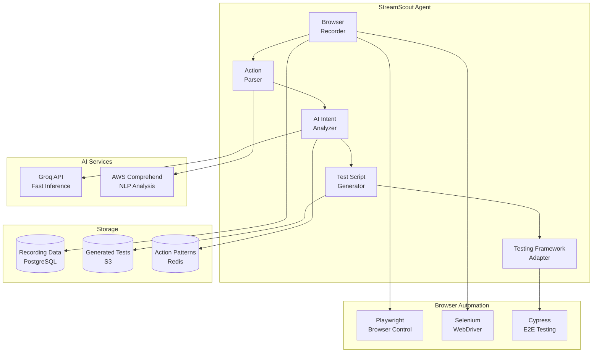

# DevMind Platform Design Document

## Overview

DevMind is a comprehensive AI-powered development assistant platform that integrates five core features through a unified architecture. The platform leverages modern cloud-native technologies, multiple AI/ML services, and real-time capabilities to provide intelligent coding support, ML pipeline orchestration, browser automation, live test monitoring, and semantic documentation generation.

The design emphasizes modularity, scalability, and cross-feature learning through a Personal Learning Memory system that adapts to user interactions across all tools.

## Architecture

### High-Level System Architecture



### Feature-Specific Architecture

#### CodeTrace Debugger Architecture



#### FlowForge Studio Architecture



#### StreamScout Agent Architecture



## Components and Interfaces

### Core API Interfaces

#### CodeTrace Debugger Interface

```typescript
interface CodeTraceDebugger {
  analyzeCode(request: CodeAnalysisRequest): Promise<CodeAnalysisResponse>
  startDebugSession(sessionId: string): Promise<DebugSession>
  getSessionHistory(userId: string): Promise<DebugSession[]>
  generateFix(bugReport: BugReport): Promise<FixSuggestion>
}

interface CodeAnalysisRequest {
  code: string
  language: ProgrammingLanguage
  context?: string
  userId: string
}

interface CodeAnalysisResponse {
  issues: CodeIssue[]
  suggestions: FixSuggestion[]
  confidence: number
  analysisTime: number
}

interface DebugSession {
  sessionId: string
  userId: string
  code: string
  issues: CodeIssue[]
  fixes: FixSuggestion[]
  timestamp: Date
  learningData: LearningContext
}
```

#### FlowForge Studio Interface

```typescript
interface FlowForgeStudio {
  createPipeline(config: PipelineConfig): Promise<Pipeline>
  validatePipeline(pipeline: Pipeline): Promise<ValidationResult>
  executePipeline(pipelineId: string): Promise<ExecutionResult>
  deployModel(modelId: string, config: DeploymentConfig): Promise<Deployment>
  monitorPipeline(pipelineId: string): Promise<PipelineMetrics>
}

interface PipelineConfig {
  name: string
  components: MLComponent[]
  connections: ComponentConnection[]
  parameters: PipelineParameters
  userId: string
}

interface MLComponent {
  id: string
  type: ComponentType
  config: ComponentConfig
  inputs: DataSchema[]
  outputs: DataSchema[]
}

interface ExecutionResult {
  pipelineId: string
  status: ExecutionStatus
  metrics: TrainingMetrics
  artifacts: ModelArtifact[]
  logs: ExecutionLog[]
}
```

#### StreamScout Agent Interface

```typescript
interface StreamScoutAgent {
  startRecording(config: RecordingConfig): Promise<RecordingSession>
  stopRecording(sessionId: string): Promise<RecordingResult>
  analyzeActions(actions: BrowserAction[]): Promise<ActionAnalysis>
  generateTests(analysis: ActionAnalysis): Promise<TestScript[]>
}

interface RecordingConfig {
  targetUrl: string
  framework: TestingFramework
  options: RecordingOptions
  userId: string
}

interface BrowserAction {
  type: ActionType
  target: ElementSelector
  value?: string
  timestamp: number
  screenshot?: string
}

interface TestScript {
  framework: TestingFramework
  code: string
  description: string
  assertions: TestAssertion[]
}
```

#### LiveTest Monitor Interface

```typescript
interface LiveTestMonitor {
  executeTests(config: TestExecutionConfig): Promise<TestExecution>
  streamTestExecution(executionId: string): Promise<LiveStream>
  getExecutionMetrics(executionId: string): Promise<ExecutionMetrics>
  generateCoverageReport(executionId: string): Promise<CoverageReport>
}

interface TestExecutionConfig {
  tests: TestSuite[]
  parallelism: number
  streamingEnabled: boolean
  userId: string
}

interface LiveStream {
  streamId: string
  videoUrl: string
  status: StreamStatus
  viewers: number
}

interface ExecutionMetrics {
  totalTests: number
  passed: number
  failed: number
  duration: number
  coverage: CoverageData
  performance: PerformanceMetrics
}
```

#### SmartDocs Generator Interface

```typescript
interface SmartDocsGenerator {
  generateDocumentation(code: CodeInput): Promise<Documentation>
  searchDocumentation(query: SearchQuery): Promise<SearchResult[]>
  updateDocumentation(docId: string, updates: DocUpdate[]): Promise<Documentation>
  getContextualExplanation(code: string, context: string): Promise<Explanation>
}

interface CodeInput {
  source: string
  language: ProgrammingLanguage
  projectContext?: ProjectContext
  userId: string
}

interface Documentation {
  id: string
  title: string
  content: DocSection[]
  examples: CodeExample[]
  searchIndex: SearchIndex
  lastUpdated: Date
}

interface SearchQuery {
  query: string
  filters: SearchFilter[]
  userId: string
  context?: string
}

interface SearchResult {
  docId: string
  title: string
  excerpt: string
  relevanceScore: number
  contextualExplanation: string
}
```

### Personal Learning Memory System

```typescript
interface PersonalLearningMemory {
  recordInteraction(interaction: UserInteraction): Promise<void>
  getPersonalizedSuggestions(userId: string, context: string): Promise<Suggestion[]>
  updateLearningModel(userId: string, feedback: UserFeedback): Promise<void>
  getInsights(userId: string): Promise<UserInsights>
}

interface UserInteraction {
  userId: string
  feature: FeatureType
  action: ActionType
  context: InteractionContext
  timestamp: Date
  outcome: InteractionOutcome
}

interface UserInsights {
  preferredLanguages: ProgrammingLanguage[]
  commonPatterns: Pattern[]
  skillLevel: SkillAssessment
  recommendations: Recommendation[]
}
```

## Data Models

### Core Data Models

```typescript
// User and Authentication
interface User {
  id: string
  email: string
  name: string
  tier: SubscriptionTier
  preferences: UserPreferences
  learningProfile: LearningProfile
  createdAt: Date
  lastActive: Date
}

interface Workspace {
  id: string
  name: string
  ownerId: string
  members: WorkspaceMember[]
  settings: WorkspaceSettings
  features: FeatureAccess[]
}

// CodeTrace Models
interface CodeIssue {
  id: string
  type: IssueType
  severity: IssueSeverity
  line: number
  column: number
  message: string
  suggestion: string
  confidence: number
}

interface FixSuggestion {
  id: string
  issueId: string
  description: string
  code: string
  explanation: string
  confidence: number
  learningSource: string
}

// FlowForge Models
interface Pipeline {
  id: string
  name: string
  userId: string
  components: MLComponent[]
  connections: ComponentConnection[]
  version: number
  status: PipelineStatus
  createdAt: Date
  lastModified: Date
}

interface ModelArtifact {
  id: string
  pipelineId: string
  name: string
  version: string
  format: ModelFormat
  size: number
  metrics: ModelMetrics
  s3Location: string
}

// StreamScout Models
interface RecordingSession {
  id: string
  userId: string
  name: string
  actions: BrowserAction[]
  duration: number
  status: RecordingStatus
  createdAt: Date
}

interface GeneratedTest {
  id: string
  recordingId: string
  framework: TestingFramework
  code: string
  description: string
  confidence: number
  validated: boolean
}

// LiveTest Models
interface TestExecution {
  id: string
  userId: string
  tests: TestCase[]
  status: ExecutionStatus
  startTime: Date
  endTime?: Date
  results: TestResult[]
  streamUrl?: string
}

interface TestResult {
  testId: string
  status: TestStatus
  duration: number
  error?: string
  screenshots: string[]
  logs: string[]
  coverage: CoverageData
}

// SmartDocs Models
interface Documentation {
  id: string
  projectId: string
  title: string
  content: string
  sections: DocSection[]
  examples: CodeExample[]
  searchIndex: string[]
  lastGenerated: Date
}

interface SearchIndex {
  documentId: string
  tokens: string[]
  embeddings: number[]
  metadata: IndexMetadata
}
```

## Correctness Properties

*A property is a characteristic or behavior that should hold true across all valid executions of a system—essentially, a formal statement about what the system should do. Properties serve as the bridge between human-readable specifications and machine-verifiable correctness guarantees.*

Based on the prework analysis, I'll now define the key correctness properties that can be validated through property-based testing:

### CodeTrace Debugger Properties

**Property 1: Code Analysis Performance**
*For any* valid code input in supported languages, the CodeTrace_Debugger should complete analysis and return structured results within 5 seconds
**Validates: Requirements 1.1**

**Property 2: Bug Detection Completeness**
*For any* code containing detectable bugs, the CodeTrace_Debugger should provide specific fix suggestions with code examples
**Validates: Requirements 1.2**

**Property 3: Session Persistence**
*For any* debug session created, the session data should be stored and retrievable from session history
**Validates: Requirements 1.3**

**Property 4: Multi-Language Support**
*For any* code input in Python, JavaScript, TypeScript, Java, or Go, the CodeTrace_Debugger should successfully analyze the code without language-specific errors
**Validates: Requirements 1.5**

### FlowForge Studio Properties

**Property 5: Component Validation**
*For any* pipeline component connections, the FlowForge_Studio should validate compatibility and reject invalid data flow configurations
**Validates: Requirements 2.2**

**Property 6: Pipeline Execution Enablement**
*For any* valid pipeline configuration, the FlowForge_Studio should enable training execution with progress tracking capabilities
**Validates: Requirements 2.3**

**Property 7: Model Deployment Availability**
*For any* successfully trained model, the FlowForge_Studio should provide deployment options to cloud infrastructure
**Validates: Requirements 2.4**

**Property 8: Version History Maintenance**
*For any* pipeline modifications, the FlowForge_Studio should maintain complete version history with functional rollback capabilities
**Validates: Requirements 2.5**

**Property 9: Real-time Pipeline Monitoring**
*For any* running pipeline, the FlowForge_Studio should provide real-time status and metrics monitoring
**Validates: Requirements 2.6**

### StreamScout Agent Properties

**Property 10: Complete Action Capture**
*For any* browser recording session, the StreamScout_Agent should capture all user interactions including clicks, inputs, and navigation events
**Validates: Requirements 3.1**

**Property 11: AI Intent Analysis**
*For any* recorded browser interactions, the StreamScout_Agent should provide AI-powered intent and context analysis
**Validates: Requirements 3.2**

**Property 12: Test Script Generation**
*For any* completed recording session, the StreamScout_Agent should generate automated test scripts from the recorded interactions
**Validates: Requirements 3.3**

**Property 13: Multi-Framework Support**
*For any* generated test script, the StreamScout_Agent should provide versions for Playwright, Selenium, and Cypress frameworks
**Validates: Requirements 3.4**

### LiveTest Monitor Properties

**Property 14: Parallel Test Execution**
*For any* test suite execution, the LiveTest_Monitor should run multiple tests in parallel to optimize execution time
**Validates: Requirements 4.1**

**Property 15: Live Stream Availability**
*For any* running test execution, the LiveTest_Monitor should provide live video streams for visual monitoring
**Validates: Requirements 4.2**

**Property 16: Performance Metrics Generation**
*For any* completed test execution, the LiveTest_Monitor should generate comprehensive performance metrics including execution time and resource usage
**Validates: Requirements 4.3**

**Property 17: Coverage Tracking**
*For any* test execution, the LiveTest_Monitor should track code coverage and provide detailed coverage reports
**Validates: Requirements 4.4**

**Property 18: Failure Documentation**
*For any* test failure, the LiveTest_Monitor should capture screenshots and logs for debugging analysis
**Validates: Requirements 4.5**

### SmartDocs Generator Properties

**Property 19: Documentation Generation**
*For any* source code input, the SmartDocs_Generator should automatically generate comprehensive documentation
**Validates: Requirements 5.1**

**Property 20: Documentation Completeness**
*For any* generated documentation, it should include code examples, parameter descriptions, and usage patterns
**Validates: Requirements 5.2**

**Property 21: Semantic Search Capability**
*For any* documentation search query, the SmartDocs_Generator should provide semantic search that understands code context and intent
**Validates: Requirements 5.3**

**Property 22: Result Ranking and Explanation**
*For any* search results returned, they should be ranked by relevance and include context-aware explanations
**Validates: Requirements 5.4**

### Personal Learning Memory Properties

**Property 23: Interaction Capture**
*For any* user interaction with platform features, the Personal_Learning_Memory should capture interaction patterns and preferences
**Validates: Requirements 6.1**

**Property 24: Cross-Feature Learning Application**
*For any* learning data collected from one feature, insights should be applied across all five core features
**Validates: Requirements 6.2**

**Property 25: Personalization**
*For any* identified user patterns, the Personal_Learning_Memory should personalize AI suggestions and recommendations
**Validates: Requirements 6.3**

**Property 26: Profile Isolation in Teams**
*For any* team workspace, the Personal_Learning_Memory should maintain separate learning profiles while enabling team insights
**Validates: Requirements 6.4**

**Property 27: Privacy Compliance**
*For any* privacy settings configuration, the Personal_Learning_Memory should respect user data preferences and consent settings
**Validates: Requirements 6.5**

### Platform Integration Properties

**Property 28: Session State Consistency**
*For any* user login, authentication should be maintained and session state should be consistent across all features
**Validates: Requirements 7.1**

**Property 29: Cross-Feature Data Consistency**
*For any* data shared between features, the platform should maintain data consistency and real-time synchronization
**Validates: Requirements 7.3**

**Property 30: Role-Based Access Control**
*For any* team collaboration scenario, the platform should enforce role-based access control correctly
**Validates: Requirements 7.4**

**Property 31: Usage Metrics Tracking**
*For any* platform usage, the system should track usage metrics for billing and optimization purposes
**Validates: Requirements 7.5**

### Performance and Security Properties

**Property 32: Response Time Compliance**
*For any* AI analysis request, the platform should respond within 5 seconds for code analysis and 10 seconds for complex ML operations
**Validates: Requirements 8.1**

**Property 33: Auto-scaling Behavior**
*For any* concurrent user load, the platform should scale automatically to handle the usage
**Validates: Requirements 8.2**

**Property 34: Data Encryption**
*For any* data processing operation, the platform should ensure encryption at rest and in transit
**Validates: Requirements 8.4**

### Pricing and Access Properties

**Property 35: Student Tier Assignment**
*For any* student registration, the platform should provide appropriate pricing tiers with correct feature limitations
**Validates: Requirements 9.1**

**Property 36: Hackathon Access Provisioning**
*For any* registered hackathon participant, the platform should offer temporary full access
**Validates: Requirements 9.2**

**Property 37: Usage Limit Notifications**
*For any* user reaching usage limits, the platform should provide clear notifications and upgrade options
**Validates: Requirements 9.3**

**Property 38: Institutional Licensing**
*For any* educational institution request, the platform should support bulk licensing with educational discounts
**Validates: Requirements 9.4**

**Property 39: Graceful Service Degradation**
*For any* free tier user exceeding limits, the platform should gracefully degrade service rather than blocking access completely
**Validates: Requirements 9.5**

<function_calls>
<invoke name="prework">
<parameter name="featureName">devmind

## Error Handling

### Error Classification and Response Strategy

#### AI Service Errors
- **LLM API Failures**: Implement circuit breaker pattern with fallback to alternative AI providers
- **Rate Limiting**: Queue requests with exponential backoff and user notification
- **Invalid AI Responses**: Validate AI outputs and provide graceful degradation with cached responses
- **Timeout Handling**: Set appropriate timeouts (5s for code analysis, 10s for ML operations) with user feedback

#### Infrastructure Errors
- **Database Connection Failures**: Implement connection pooling with automatic retry and failover
- **Cache Misses**: Graceful degradation to primary data sources without user impact
- **File Storage Errors**: Retry mechanisms for S3 operations with local temporary storage fallback
- **Network Partitions**: Offline-first design for critical features with sync when connectivity restored

#### User Input Errors
- **Invalid Code Submissions**: Syntax validation with helpful error messages and suggestions
- **Malformed Pipeline Configurations**: Real-time validation with specific error highlighting
- **Authentication Failures**: Clear error messages with recovery options and support contact
- **Permission Denied**: Contextual error messages explaining required permissions and upgrade paths

#### Resource Exhaustion
- **Memory Limits**: Streaming processing for large files with progress indicators
- **CPU Overload**: Request queuing with estimated wait times and priority handling
- **Storage Limits**: Proactive warnings at 80% capacity with cleanup suggestions
- **Concurrent User Limits**: Queue management with fair scheduling and upgrade prompts

### Error Recovery Mechanisms

#### Automatic Recovery
- **Transient Failures**: Exponential backoff retry with jitter
- **Service Degradation**: Automatic failover to backup services
- **Data Corruption**: Checksums and automatic repair from replicas
- **Session Loss**: Automatic session restoration from persistent storage

#### User-Initiated Recovery
- **Manual Retry Options**: Clear retry buttons with progress indication
- **Alternative Workflows**: Suggest alternative approaches when primary fails
- **Data Export**: Allow users to export work before system maintenance
- **Support Escalation**: Easy access to support with automatic error context sharing

## Testing Strategy

### Dual Testing Approach

The DevMind platform requires comprehensive testing through both unit tests and property-based tests to ensure correctness across all features and user scenarios.

#### Unit Testing Strategy
Unit tests focus on specific examples, edge cases, and integration points:

- **API Endpoint Testing**: Verify specific request/response patterns for each feature
- **Component Integration**: Test interactions between core features and external services
- **Edge Case Validation**: Test boundary conditions, empty inputs, and malformed data
- **Error Condition Testing**: Verify proper error handling and user feedback
- **Authentication Flow Testing**: Test login, logout, and session management scenarios
- **Database Operation Testing**: Verify CRUD operations and data consistency

#### Property-Based Testing Strategy
Property-based tests verify universal properties across all inputs using randomized test data:

**Testing Framework**: Use **Hypothesis** for Python backend services and **fast-check** for TypeScript/JavaScript components

**Test Configuration**:
- Minimum **100 iterations** per property test to ensure comprehensive coverage
- Each property test tagged with: **Feature: devmind, Property {number}: {property_text}**
- Randomized test data generation for code samples, user inputs, and system configurations

**Property Test Categories**:

1. **Performance Properties**: Verify response time requirements across all input types
2. **Data Integrity Properties**: Ensure data consistency across feature boundaries
3. **Learning System Properties**: Validate personalization and cross-feature learning
4. **Security Properties**: Verify encryption and access control across all operations
5. **Scalability Properties**: Test system behavior under various load conditions

**Example Property Test Implementation**:
```typescript
// Feature: devmind, Property 1: Code Analysis Performance
test('code analysis completes within time bounds', async () => {
  await fc.assert(fc.asyncProperty(
    fc.record({
      code: fc.string({ minLength: 10, maxLength: 10000 }),
      language: fc.constantFrom('python', 'javascript', 'typescript', 'java', 'go')
    }),
    async (input) => {
      const startTime = Date.now();
      const result = await codeTraceDebugger.analyzeCode(input);
      const duration = Date.now() - startTime;
      
      expect(duration).toBeLessThan(5000); // 5 second requirement
      expect(result).toHaveProperty('issues');
      expect(result).toHaveProperty('suggestions');
    }
  ), { numRuns: 100 });
});
```

#### Integration Testing
- **Cross-Feature Integration**: Test data flow and learning between all five core features
- **External Service Integration**: Test AI/ML service integrations with mock and real services
- **Real-time Communication**: Test WebSocket connections and live streaming functionality
- **Database Integration**: Test complex queries and transaction handling

#### End-to-End Testing
- **User Journey Testing**: Test complete workflows from login to feature usage
- **Browser Automation Testing**: Use generated StreamScout tests to validate the platform
- **Performance Testing**: Load testing with realistic user patterns and data volumes
- **Security Testing**: Penetration testing and vulnerability scanning

#### Continuous Testing Pipeline
- **Pre-commit Hooks**: Run unit tests and linting before code commits
- **Pull Request Testing**: Full test suite execution including property tests
- **Staging Environment Testing**: Integration and E2E tests on production-like environment
- **Production Monitoring**: Continuous monitoring with automated alerting for failures

### Test Data Management
- **Synthetic Data Generation**: Create realistic test data for all features without using real user data
- **Test Environment Isolation**: Separate test databases and AI service quotas
- **Data Cleanup**: Automated cleanup of test data after test execution
- **Performance Benchmarking**: Maintain performance baselines and detect regressions

### Quality Gates
- **Code Coverage**: Minimum 80% code coverage for all core features
- **Property Test Coverage**: All 39 correctness properties must have corresponding property tests
- **Performance Benchmarks**: All response time requirements must pass in CI/CD pipeline
- **Security Scans**: No high-severity security vulnerabilities in production deployments

This comprehensive testing strategy ensures the DevMind platform maintains high quality, performance, and reliability across all features while supporting rapid development and deployment cycles.